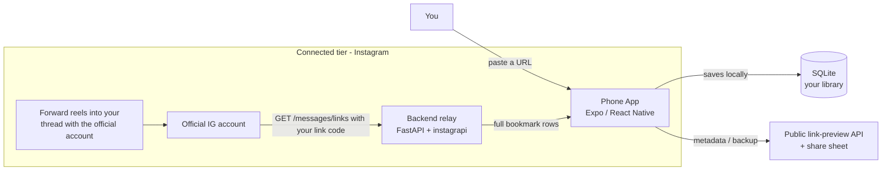
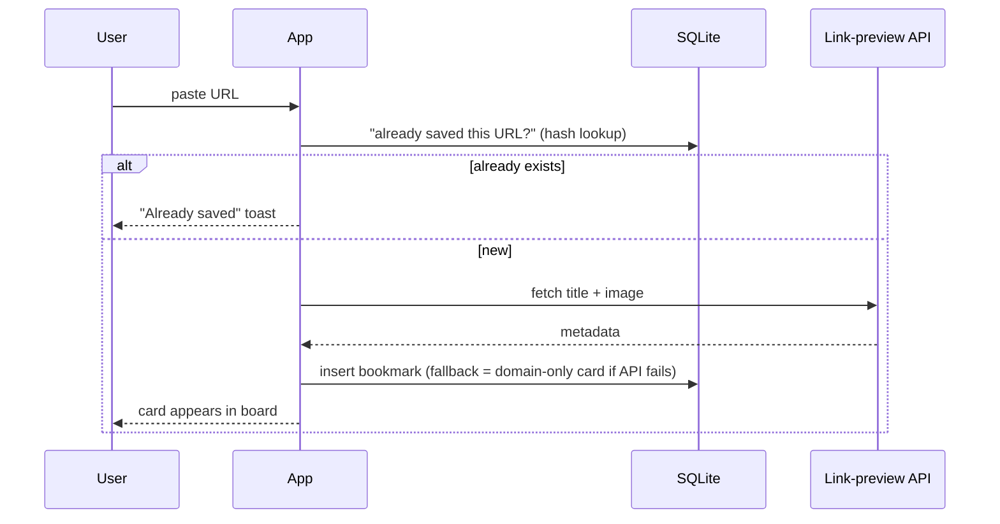
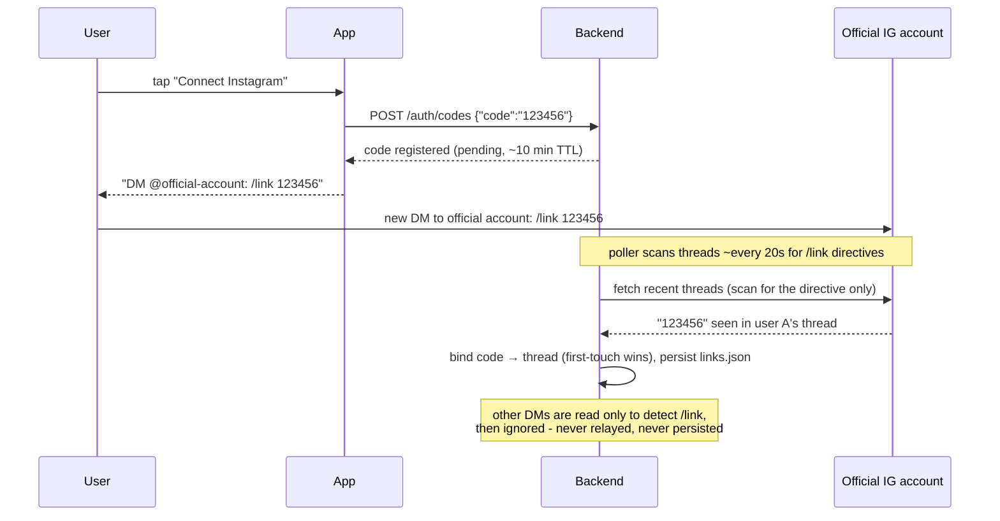
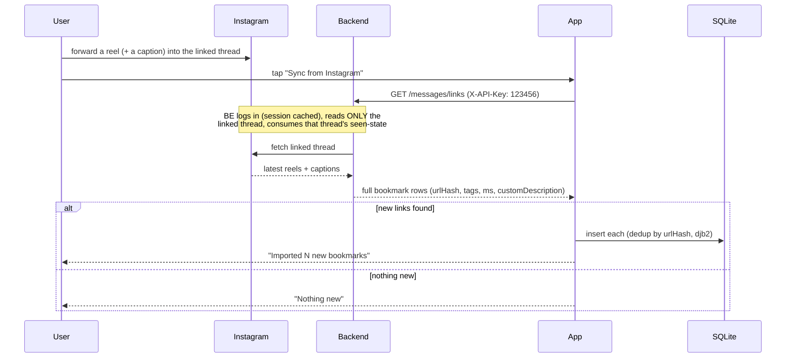
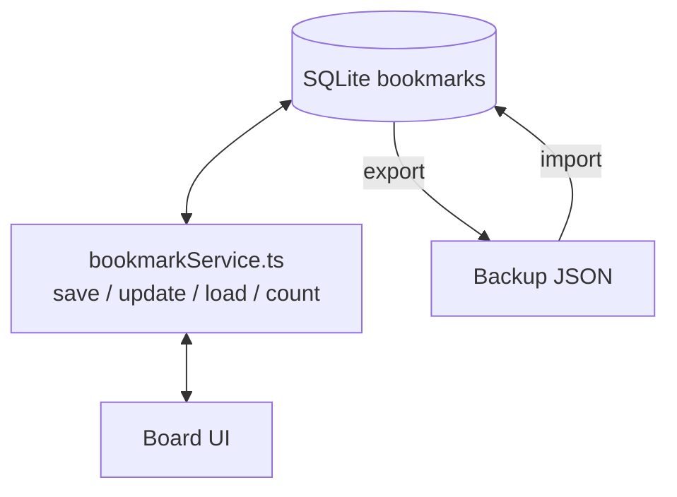

# 2. Architecture

How the pieces fit together, in plain words.

## 2.1 Big picture

There are three actors: the **phone app** (your library), the **Instagram servers** (where the DMs and reels live), and the **backend** (a multi-user FastAPI relay that logs into an official Instagram account on your behalf). The app owns all of your bookmarks; the backend only relays the reels you forward into a **linked DM thread** with the official account.

**Linking:** to connect, the app shows a 6-digit code (`POST /auth/codes`), then you DM the official account `/link <code>`. The backend scans for that directive, binds the code to your thread, and from then on relays **only that thread's** forwarded reels to the caller presenting the code. Unregistered DMs are read solely to detect a `/link` directive and otherwise ignored.

**Key idea: the app is the single source of truth.** The backend never stores bookmarks — it answers "what's new in my linked Instagram thread?". When the app gets the answer, it saves the rows into its own SQLite database, same as a pasted link.

## 2.2 Saving flow — free (paste a link)

The same flow runs for rich links (YouTube etc.) that need a third-party "unlocker" service when the free path comes up empty — the app tries simple → then fancier sources. See 2.4.

## 2.3 Saving flow — connected (Instagram DMs via a linked thread)

**Phase 1 — link once:**

**Phase 2 — sync (runs each time you want new saves):**

**What the backend does** (exactly three things): authenticate with Instagram, fetch your linked thread's DMs on demand, and return new bookmarks. It does **not** store bookmarks, call link-preview APIs, or manage app state.

### 2.3.1 Auth & linking rules

- The 6-digit code is a **channel token**: registering one binds nobody. Binding happens only when *a thread* DMs `/link <code>` — the first thread to claim it becomes the code's identity, and a second thread sending the same code is rejected.
- Pending codes expire after ~10 minutes; a code expires the moment it binds.
- **Unregistered DMs are invisible:** the poller reads text only to detect `/link <code>` directives. Anything else in an unlinked thread is never relayed, never persisted, and never advances seen-state — so reels forwarded *before* linking are still delivered fresh after the link.
- `/messages`, `/messages/links`, `/messages/history` and `/debug/*` require the code (`X-API-Key: <code>` or `Authorization: Bearer <code>`). `/health` and `POST /auth/codes` are open.
- Bad or unregistered `/link` attempts are ignored silently — no auto-reply from the official account.

| Endpoint                              | Auth  | Purpose                                                       |
| ------------------------------------- | ----- | ------------------------------------------------------------- |
| `GET /health`                         | open  | Liveness                                                      |
| `POST /auth/codes`                    | open  | Register a pending 6-digit code                               |
| `GET /auth/status`                    | code  | Is my code linked? which account/thread?                      |
| `GET /messages/links`                 | code  | New forwarded reels for **my** thread — **consumes** seen-state |
| `GET /messages`                       | code  | Read-only peek of my thread                                   |
| `GET /messages/history`               | code  | Filtered lookup of my thread                                  |
| `GET /metadata`                       | open  | og: tag extractor (walled-site fallback)                      |
| `POST /debug/reset`, `GET /debug/raw` | code  | Diagnostics for my thread                                     |

## 2.4 Getting a bookmark's title/image ("enrichment") — the ladder

The app fills in the pretty parts (title, thumbnail) from the best source it can reach, in order:

| Step | Source                              | When                                                                                                      |
| ---- | ----------------------------------- | --------------------------------------------------------------------------------------------------------- |
| 1    | The DM payload itself               | Connected tier: captions + preview image come from Instagram directly                                     |
| 2    | Device-side fetch of the page       | Normal websites, fast and private                                                                         |
| 3    | Self-hosted extractor (`/metadata`) | Walled platforms (Instagram/TikTok/Pinterest/YouTube) — a special crawler fetcher that reads the og: tags |
| 4    | Public link-preview API             | Safety net when all of the above fail                                                                     |

If everything fails, the app still saves a valid card with the domain as the title (never loses your link).

## 2.5 Storage — your library

- **Database:** SQLite on the phone (Drizzle ORM). One table `bookmarks` + a single `settings` row (profile, theme, server URL). Indexes on createdAt/type/favorite/archived/read for fast filtering.
- **Backup:** export the whole library as a versioned JSON file (share sheet) → import restores it. Local-only; no cloud by default.

## 2.6 The one-row rule (data contract, plain)

Every bookmark is one row with the same fields, filled the same way no matter how it was saved:

- **Identity:** `url` + `urlHash` (dedup).
- **Auto metadata:** `title`, `description`, `image`, `favicon`, `siteName`, `author`, `type`, etc. — fetched automatically.
- **User words:** `customTitle`, `customDescription`, `notes`, `tags`. On display, user words win (`customTitle || title`).
- **Flags & time:** favorite/read/archived, `createdAt`/`updatedAt` (milliseconds).

Full column list: `db/schema.ts`. Migration history: `drizzle/0001*` → `0002*` (indexes for speed).

## 2.7 Current gaps (real status, honest)

The backend (`backend/`) is now a **structured relay (D-016)**: multi-user FastAPI with the link-code flow, per-thread isolation, the `/metadata` extractor restored, responses matching the app's bookmark shape (djb2 `urlHash`, app-aligned `type`, ms timestamps, real `tags` array, 120s caption merge), and secrets/state gitignored. The **app side** (D-017) is wired and live:

1. **Ingestion client:** `utils/igDm.ts` (`generateAndRegisterCode`, `getCodeStatus`, `fetchNewLinks`, `syncNow`) with a module run-lock; `insertDmBookmarks` in `db/bookmarkService.ts` dedupes on the app's own djb2 `urlHash` (`onConflictDoNothing`), so the same reel saved free or via DM is one row.
2. **Connect UI:** "Instagram sync" group in the Profile panel — `POST /auth/codes` → shows the code + `/link <code>` steps → polls `/auth/status` ~5s → linked state with "Sync now" and "Forget connection". Code persisted in the `ig_code` settings column (migration `0003`).
3. **Adoption path:** the backend scans for the directive `^/link <link_code>` (case-insensitive) in inbox threads; a shared-code binding is **first-touch-wins** (`links.json`), expires after ~10 minutes if unbound, and own messages are skipped (you can't self-link). Users forward reels *into their thread with the official account* instead of self-DMing — onboarding copy (the Profile group) says so.
4. Other connectors are design-only the `Connector` ABC is the slot; Telegram/Discord/Slack implementations don't exist yet. Background fetch (`expo-background-task`) and the backend's buffered mailbox are deferred (D-017).
