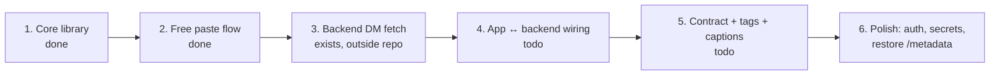

# 4. Implementation Plan

What we build, in what order, and how we know it works. Checkboxes = live status.

## 4.1 The roadmap

**What's done:** schema, bookmarks board (grid/search/filter/sort), per-bookmark actions, edit/tags/backup, the backend's DM _fetcher_ (running live on the dev machine).
**What's missing:** the app actually calling the backend, and both sides agreeing on the response shape.

## 4.2 Build order (from `plans/freemiumVersio.md`, condensed)

1. **Freeze the schema.** Don't rename columns after this. (done)
2. **One shared insert function** — `insertBookmark()` used by _both_ save paths, with `onConflictDoNothing` on `urlHash`. This is the whole game: one row shape, one insert, dedupe for free.
3. **Free tier end-to-end** — paste → fetch → insert → render. Graceful fallback (domain-only card) when the network fails. (done)
4. **Backend `/messages/links` returns the full bookmark shape** (see API doc §3.3) — hardcoded sample data first, real instagrapi after.
5. **Caption + tags** — same-sender text within the window merges into `customDescription`; `#hashtags` → `tags`. Match the spec's 120s window & concatenation rule.
6. **App↔backend wiring** — new client call (`GET {serverUrl}/messages/links`, timeout/abort like the metadata client), ingest each item through `insertBookmark()`, show import count/toasts from a "Sync from Instagram" action.
7. **Dedup test** — save the same reel via paste _and_ via DM → verify it's one row.

## 4.3 Work packages (small enough to ship one at a time)

### WP-A — Contract alignment (backend)

- [ ] Return `url`/`urlHash`/`domain`/`path`/`mediaType`/`tags`/`customDescription`… per §3.3 shape.
- [ ] Caption window `15s → 120s`; concatenate multiple texts; don't leak caption-messages as separate items.
- [ ] Extract `#hashtags` → `tags` (real array).
- [ ] Timestamps → ms; text → `""`.
- [ ] Restore `/metadata` (old extractor routes) into the same service so walled-site enrichment works again.

### WP-B — App ingestion (frontend)

- [x] `utils/igDm.ts` — DM relay client (`generateAndRegisterCode`, `getCodeStatus`, `fetchNewLinks`, `syncNow`), mirroring `utils/metadata.ts` (12s timeout).
- [x] Ingest: `insertDmBookmarks` dedupes on the app's own djb2 `urlHash` (`onConflictDoNothing`), sender timestamp wins as `createdAt`.
- [x] UI: "Instagram sync" group in the Profile panel (connect → `/link <code>` → 5s polling → linked state → Sync now) + result toasts; auto-runs on pull-to-refresh (silent, parallel with the grid refetch).
- [x] Settings section renamed (no longer "Not connected yet"); `igCode` persisted in the new `settings` column (migration 0003).
- [ ] Deferred: background fetch (`expo-background-task`/`-fetch` + `syncTask.ts`, needs a native rebuild) and the backend's buffered mailbox (app-side pulls become load-light).
- [ ] Set the real `IG_HANDLE` in `utils/igDm.ts` (currently a placeholder).

### WP-C — Safety & hygiene

- [ ] Add shared-secret check to the DM endpoints (reuse the app's `apiKey` setting).
- [ ] Add `.env`, `session.json`, `seen_messages.json` to ignore rules; never commit credentials.
- [ ] Move live backend under version control (or document the copy-in procedure).

## 4.4 Definition of done (each WP)

- tsc, ESLint, Prettier all clean (`npm run lint`).
- Manual on-device check: the listed scenario behaves correctly (paste / DM sync / reload).
- The lib stays smooth (no per-frame re-renders from new state).

## 4.5 Verification checklist (final)

- [ ] Same reel saved free + connected → one row.
- [ ] Same URL twice → "already saved".
- [ ] DM caption appears under the bookmark (editable), `description` stays auto-only.
- [ ] Backup export → reinstall → import → identical library.
- [ ] Offline: board, search, and edits all work with no network.
- [ ] `/messages` (peek) never advances the "seen" marker; `/messages/links` does.
- [ ] No Facebook-public-API nests: DM path never calls the link-preview API.
